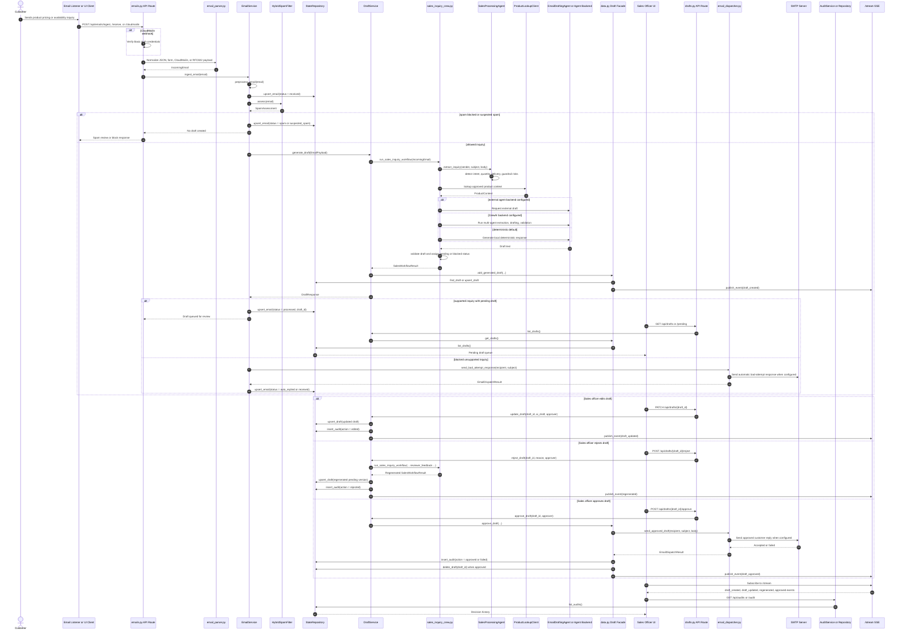
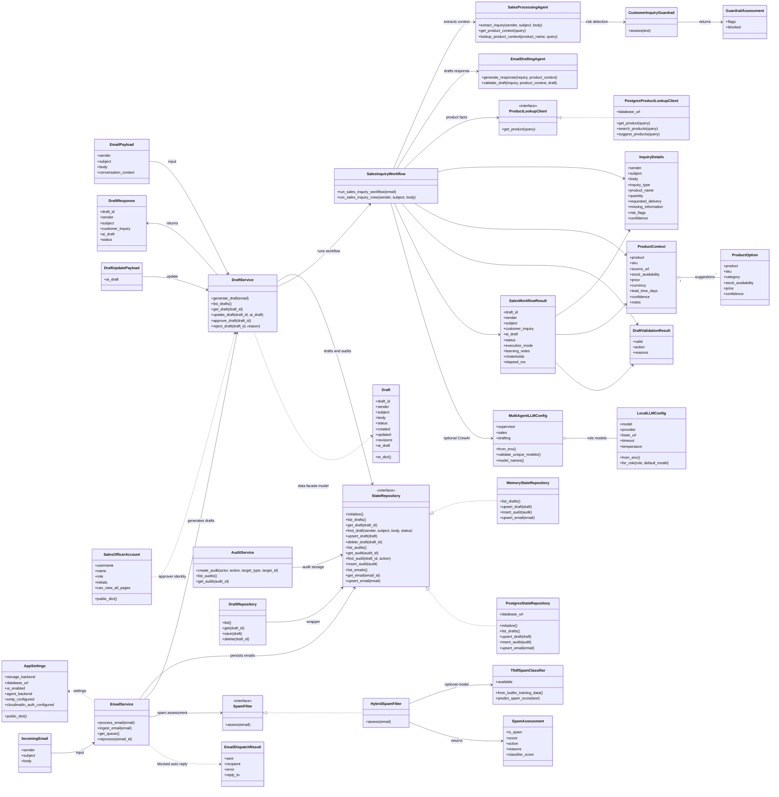
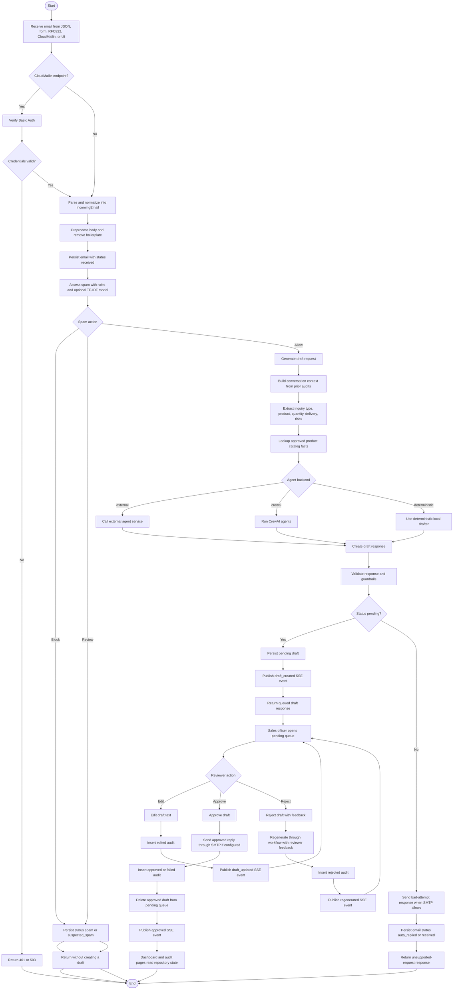

# Project Swift System Workflow Diagrams

These diagrams describe the current Project Swift modules and the sales inquiry workflow implemented across `app/main.py`, API routes, services, repositories, `data.py`, and `app/crews`.

## Sequence Diagram

## Use Case Diagram

Mermaid does not have a dedicated UML use-case renderer, so this uses Mermaid flowchart syntax with actors and oval use cases.

## Class Diagram

## Activity Diagram

