# Project Swift System Workflow Diagrams

These diagrams describe the current Project Swift modules and the sales inquiry workflow implemented across `app/main.py`, API routes, services, repositories, `data.py`, and `app/crews`.

## Sequence Diagrams

### Email Ingestion

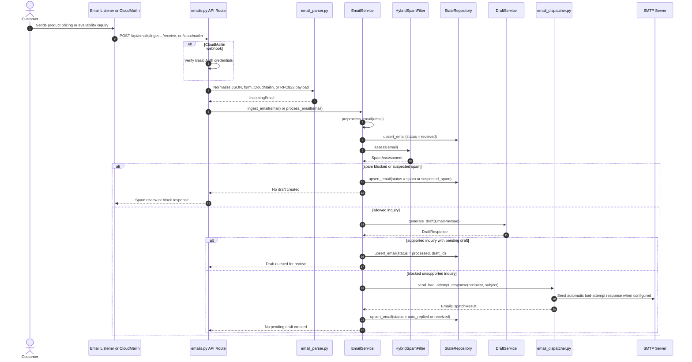

### Draft Generation

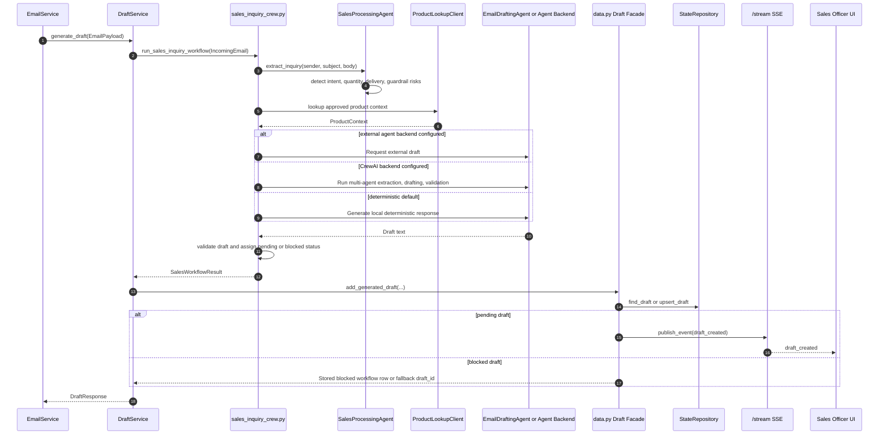

### Draft Review, Regeneration, and Approval

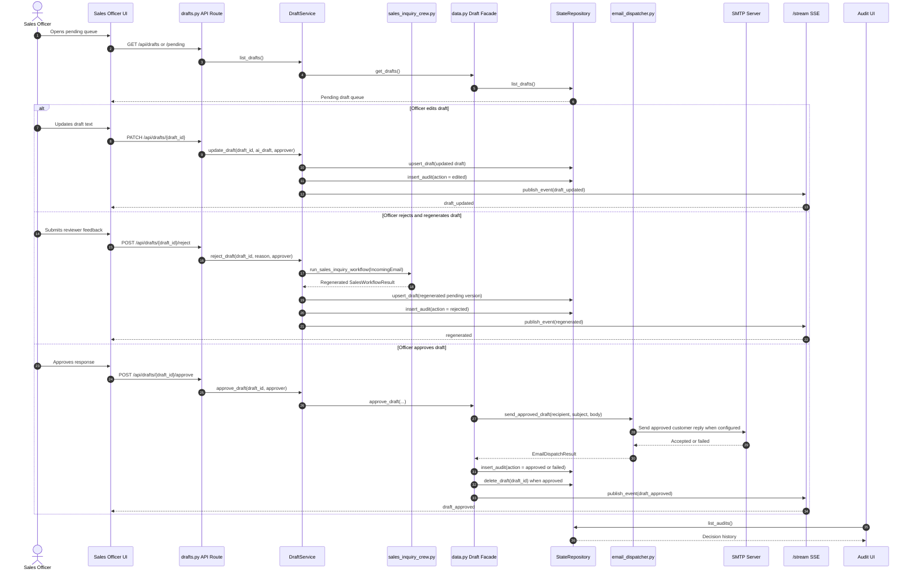

## Use Case Diagram

Mermaid does not have a dedicated UML use-case renderer, so this uses Mermaid flowchart syntax with actors and oval use cases.

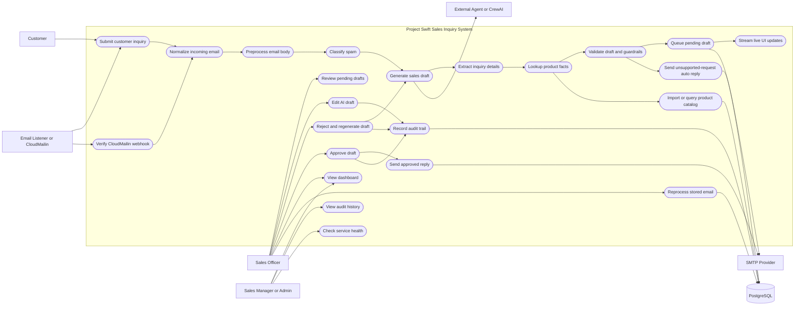

## Class Diagram

This diagram includes production classes and data models that have at least one
direct relationship with another class in the diagram. It excludes test-only
classes, private helpers, route functions, module-level workflow functions, and
isolated utility classes that would not add a class-to-class relation.

```mermaid
classDiagram
    direction LR

    class AppSettings {
        +storage_backend: str
        +database_url: str
        +agent_backend: str
        +smtp_configured
        +smtp_from_address
        +public_dict()
    }

    class IncomingEmail {
        +sender: str
        +subject: str
        +body: str
    }

    class EmailPayload {
        +sender: str
        +subject: str
        +body: str
        +conversation_context: str
    }

    class DraftUpdatePayload {
        +ai_draft: str
    }

    class DraftResponse {
        +draft_id: str
        +sender: str
        +subject: str
        +customer_inquiry: str
        +ai_draft: str
        +status: str
    }

    class Draft {
        +draft_id: str
        +sender: str
        +subject: str
        +status: str
        +revisions: int
        +thread_history: list
        +to_dict()
    }

    class EmailService {
        +repository: StateRepository
        +draft_service: DraftGenerator
        +bad_attempt_responder: BadAttemptResponder
        +spam_filter: SpamFilter
        +process_email(email)
        +ingest_email(email)
        +get_queue()
        +reprocess(email_id)
    }

    class DraftGenerator {
        <<interface>>
        +generate_draft(email)
    }

    class BadAttemptResponder {
        <<interface>>
        +__call__(recipient, subject)
    }

    class DraftService {
        +repository: StateRepository
        +generate_draft(email)
        +list_drafts()
        +get_draft(draft_id)
        +update_draft(draft_id, ai_draft)
        +approve_draft(draft_id)
        +reject_draft(draft_id, reason)
    }

    class AuditService {
        +repository: StateRepository
        +create_audit(actor, action, target_type, target_id)
        +list_audits()
        +get_audit(audit_id)
    }

    class AuditLogger {
        +audit_sink: AuditLogSink
        +table_name: str
        +save(log_data)
    }

    class AuditLogSink {
        <<interface>>
        +insert(table_name, row)
    }

    class StateRepository {
        <<interface>>
        +initialize()
        +list_drafts()
        +get_draft(draft_id)
        +upsert_draft(draft)
        +delete_draft(draft_id)
        +list_audits()
        +insert_audit(audit)
        +list_emails()
        +get_email(email_id)
        +upsert_email(email)
        +list_users()
        +get_user_by_username(username)
        +upsert_user(user)
        +find_thread(sender, subject)
        +insert_thread_message(message)
        +get_setting(key)
        +upsert_setting(setting)
    }

    class MemoryStateRepository {
        +_drafts: dict
        +_audits: dict
        +_emails: dict
        +_users: dict
    }

    class PostgresStateRepository {
        +database_url: str
        +initialize()
    }

    class DraftRepository {
        +repository: StateRepository
        +list()
        +get(draft_id)
        +save(draft)
        +delete(draft_id)
    }

    class AuditRepository {
        +repository: StateRepository
        +list()
        +get(audit_id)
        +insert(audit)
    }

    class SalesOfficerAccount {
        +username: str
        +email: str
        +name: str
        +level: str
        +can_view_all_pages
        +public_dict()
    }

    class SpamFilter {
        <<interface>>
        +assess(email)
    }

    class HybridSpamFilter {
        +classifier: TfidfSpamClassifier
        +spam_threshold: float
        +suspected_threshold: float
        +assess(email)
    }

    class TfidfSpamClassifier {
        +pipeline: object
        +available
        +from_builtin_training_data()
        +predict_spam_score(text)
    }

    class SpamAssessment {
        +is_spam: bool
        +score: float
        +action: str
        +reasons: list
        +classifier_score: float
    }

    class EmailPreprocessor {
        +noise_filter: StructuralNoiseFilter
        +relevance_selector: InquiryLineSelector
        +preprocess(email)
    }

    class StructuralNoiseFilter {
        +remove(body)
    }

    class InquiryLineSelector {
        +select(lines)
    }

    class PreprocessedEmail {
        +email: IncomingEmail
        +original_body: str
        +removed_lines: list
        +changed
    }

    class FilteredEmailLines {
        +kept: list
        +removed: list
    }

    class CustomerInquiryGuardrail {
        +rules: tuple
        +assess(text)
    }

    class GuardrailRule {
        +flag: str
        +patterns: tuple
    }

    class GuardrailAssessment {
        +flags: list
        +blocked
    }

    class SalesProcessingAgent {
        +product_client: ProductLookupClient
        +extract_inquiry(sender, subject, body)
        +get_product_context(query)
        +lookup_product_context(product_name, query)
        +lookup_product_list_context(query)
        +detect_risks(text)
    }

    class EmailDraftingAgent {
        +generate(info)
        +generate_response(inquiry, product_context)
        +validate_draft(inquiry, product_context, draft)
    }

    class ProductLookupClient {
        <<interface>>
        +get_product(query)
    }

    class PostgresProductLookupClient {
        +database_url: str
        +get_product(query)
        +search_products(query, limit)
        +suggest_products(query, limit)
    }

    class InquiryDetails {
        +sender: str
        +subject: str
        +body: str
        +inquiry_type: str
        +product_name: str
        +quantity: int
        +risk_flags: list
        +confidence: float
    }

    class ProductOption {
        +product: str
        +sku: str
        +source_url: str
        +stock_availability: int
        +price: float
        +confidence: float
    }

    class ProductContext {
        +product: str
        +sku: str
        +source_url: str
        +stock_availability: int
        +price: float
        +currency: str
        +suggested_products: list
        +listed_products: list
    }

    class DraftValidationResult {
        +valid: bool
        +action: str
        +reasons: list
    }

    class SalesWorkflowResult {
        +draft_id: str
        +sender: str
        +subject: str
        +customer_inquiry: str
        +inquiry: InquiryDetails
        +product_context: ProductContext
        +ai_draft: str
        +validation: DraftValidationResult
        +status: str
        +supervisor_review: DraftValidationResult
    }

    class EmailDispatchResult {
        +sent: bool
        +recipient: str
        +error: str
        +reply_to: str
    }

    EmailService o-- StateRepository : persists intake
    EmailService o-- DraftGenerator : generates drafts
    EmailService o-- BadAttemptResponder : blocked response
    EmailService o-- SpamFilter : spam assessment
    EmailService ..> IncomingEmail : accepts
    EmailService ..> EmailPayload : creates
    EmailService ..> DraftResponse : returns
    EmailService ..> EmailPreprocessor : cleans email
    EmailService ..> EmailDispatchResult : reports auto reply

    DraftGenerator <|.. DraftService
    DraftService o-- StateRepository : review state
    DraftService ..> EmailPayload : accepts
    DraftService ..> DraftResponse : returns
    DraftService ..> DraftUpdatePayload : edit payload
    DraftService ..> Draft : maps review rows
    DraftService ..> SalesWorkflowResult : persists workflow
    DraftService ..> EmailDispatchResult : approval dispatch
    DraftService ..> SalesOfficerAccount : reviewer identity

    AuditService o-- StateRepository : audit store
    DraftRepository o-- StateRepository : legacy wrapper
    AuditRepository o-- StateRepository : legacy wrapper
    AuditLogger o-- AuditLogSink : writes through

    StateRepository <|.. MemoryStateRepository
    StateRepository <|.. PostgresStateRepository
    PostgresStateRepository ..> AppSettings : database config
    StateRepository ..> SalesOfficerAccount : user rows

    SpamFilter <|.. HybridSpamFilter
    HybridSpamFilter o-- TfidfSpamClassifier : optional model
    HybridSpamFilter ..> IncomingEmail : scans
    HybridSpamFilter ..> SpamAssessment : returns

    EmailPreprocessor *-- StructuralNoiseFilter : removes noise
    EmailPreprocessor *-- InquiryLineSelector : selects inquiry
    EmailPreprocessor ..> IncomingEmail : accepts
    EmailPreprocessor ..> PreprocessedEmail : returns
    StructuralNoiseFilter ..> FilteredEmailLines : returns
    PreprocessedEmail *-- IncomingEmail : cleaned email

    CustomerInquiryGuardrail o-- GuardrailRule : evaluates rules
    CustomerInquiryGuardrail ..> GuardrailAssessment : returns
    SalesProcessingAgent ..> CustomerInquiryGuardrail : risk checks

    SalesProcessingAgent o-- ProductLookupClient : product facts
    ProductLookupClient <|.. PostgresProductLookupClient
    PostgresProductLookupClient ..> AppSettings : database config
    SalesProcessingAgent ..> InquiryDetails : extracts
    SalesProcessingAgent ..> ProductContext : creates
    SalesProcessingAgent ..> ProductOption : suggestions

    EmailDraftingAgent ..> InquiryDetails : uses
    EmailDraftingAgent ..> ProductContext : uses
    EmailDraftingAgent ..> DraftValidationResult : returns

    SalesWorkflowResult *-- InquiryDetails : inquiry
    SalesWorkflowResult *-- ProductContext : product context
    SalesWorkflowResult *-- DraftValidationResult : validation
    ProductContext o-- ProductOption : product lists
    BadAttemptResponder ..> EmailDispatchResult : returns
```

## Activity Diagrams

### Submit and Ingest Email

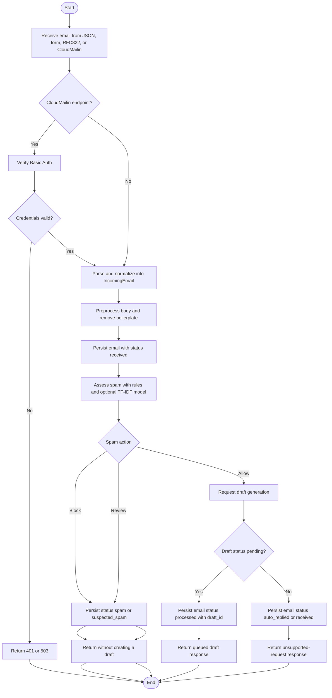

### Generate Sales Draft

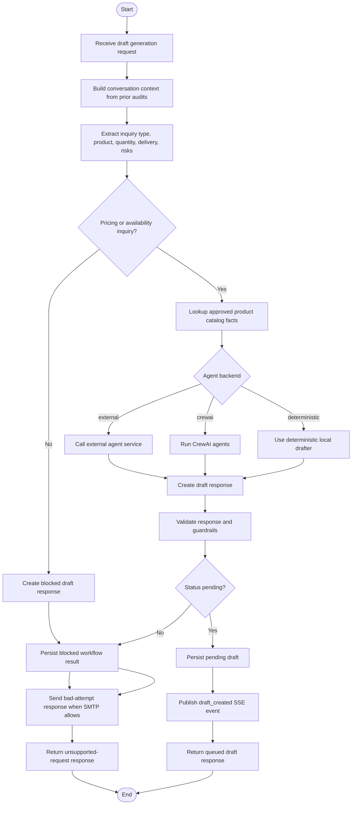

### Review and Edit Draft

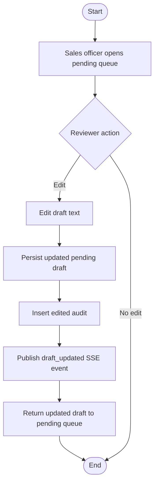

### Reject and Regenerate Draft

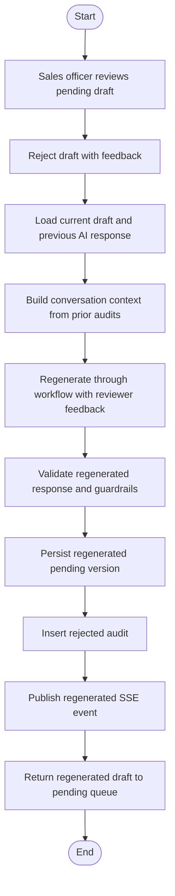

### Approve and Send Draft

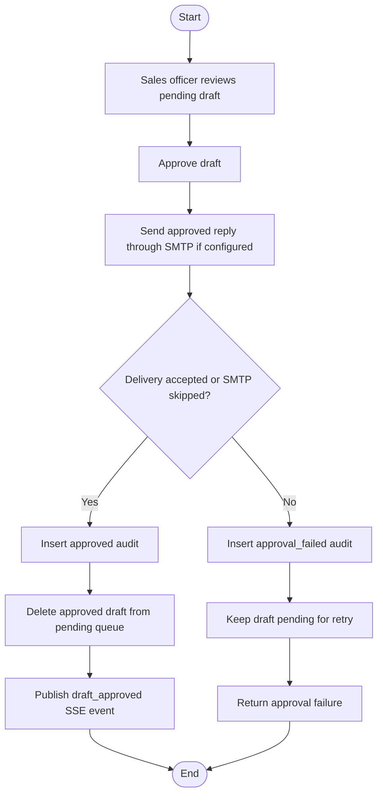

### Operator Views and Maintenance

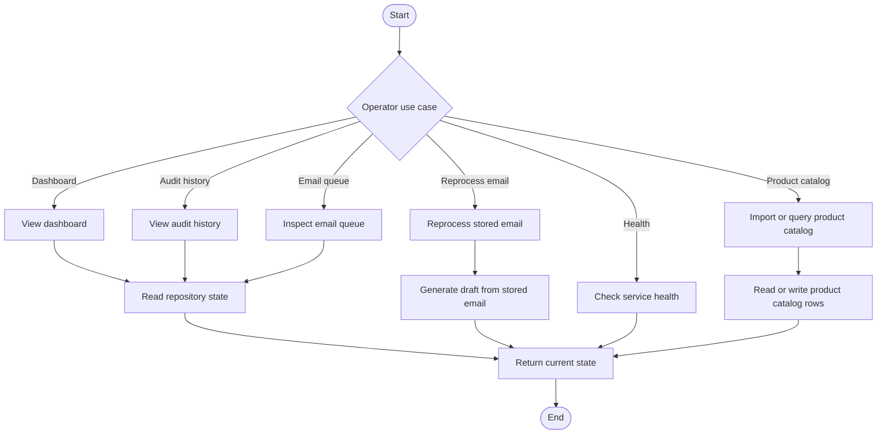
